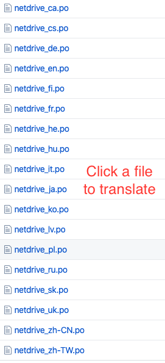
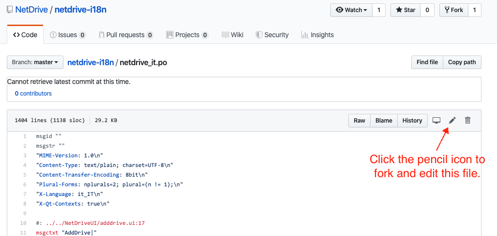
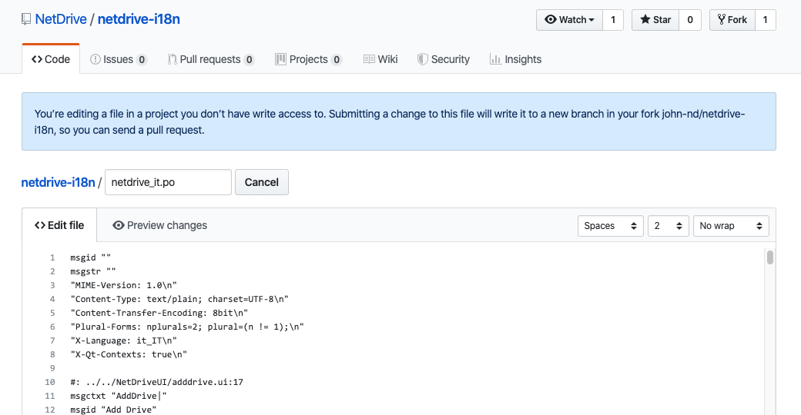
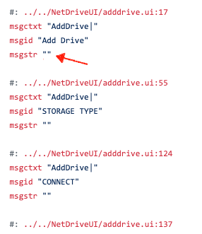

# NetDrive Translations

| Code | Language | File Name | The most recent version translated | Contributors |
----------| ----------|----------|------------|---------|
zh-TW | Traditional Chinese | [netdrive_zh-TW.po](https://github.com/bdrive/netdrive3-i18n/blob/master/netdrive_zh-TW.po) | 3.9 | [@Hs0](https://github.com/Hs0) |
nl | Dutch | [netdrive_nl.po](https://github.com/bdrive/netdrive3-i18n/blob/master/netdrive_nl.po) | 3.9 | tchabot |
ko | Korean | [netdrive_ko.po](https://github.com/bdrive/netdrive3-i18n/blob/master/netdrive_ko.po) | 3.9 | [@JulianYoon](https://github.com/JulianYoon) |
ru | Russian | [netdrive_ru.po](https://github.com/bdrive/netdrive3-i18n/blob/master/netdrive_ru.po) | 3.9 | [@hookzof](https://github.com/hookzof) and [@iFrez](https://github.com/iFrez) |
es | Spanish | [netdrive_es.po](https://github.com/bdrive/netdrive3-i18n/blob/master/netdrive_es.po) | 3.8 | [@pjmh81](https://github.com/Pjmh81) |
de | German | [netdrive_de.po](https://github.com/bdrive/netdrive3-i18n/blob/master/netdrive_de.po) | 3.8  | [Reiser89](https://github.com/Reiser89) |
hu | Hungarian | [netdrive_hu.po](https://github.com/bdrive/netdrive3-i18n/blob/master/netdrive_hu.po) | 3.8 | oreg |
it | Italian | [netdrive_it.po](https://github.com/bdrive/netdrive3-i18n/blob/master/netdrive_it.po) | 3.8 | [@bovirus](https://github.com/bovirus) |
vi | Vietnamese | [netdrive_vi.po](https://github.com/bdrive/netdrive3-i18n/blob/master/netdrive_vi.po) | 3.8 | [@thanthhot](https://github.com/thanhthot) |
zh-CN | Simplified Chinese | [netdrive_zh-CN.po](https://github.com/bdrive/netdrive3-i18n/blob/master/netdrive_zh-CN.po) | 3.8 | [@airxw](https://github.com/airxw) |
ca | Catalan | [netdrive_ca.po](https://github.com/bdrive/netdrive3-i18n/blob/master/netdrive_ca.po) |  | |
cs | Czech | [netdrive_cs.po](https://github.com/bdrive/netdrive3-i18n/blob/master/netdrive_cs.po) |  | |
fi | Finnish | [netdrive_fi.po](https://github.com/bdrive/netdrive3-i18n/blob/master/netdrive_fi.po) |  | |
fr | French | [netdrive_fr.po](https://github.com/bdrive/netdrive3-i18n/blob/master/netdrive_fr.po) |  | |
hy | Armenian | [netdrive_hy.po](https://github.com/bdrive/netdrive3-i18n/blob/master/netdrive_hy.po) |  | |
he | Hebrew | [netdrive_he.po](https://github.com/bdrive/netdrive3-i18n/blob/master/netdrive_he.po) |  | |
ja | Japanese | [netdrive_ja.po](https://github.com/bdrive/netdrive3-i18n/blob/master/netdrive_ja.po) |  | |
lv | Latvian | [netdrive_lv.po](https://github.com/bdrive/netdrive3-i18n/blob/master/netdrive_lv.po) |  | |
po | Polish | [netdrive_pl.po](https://github.com/bdrive/netdrive3-i18n/blob/master/netdrive_pl.po) |  | |
sk | Slovak | [netdrive_sk.po](https://github.com/bdrive/netdrive3-i18n/blob/master/netdrive_sk.po) |  | |
uk | Ukrainian | [netdrive_uk.po](https://github.com/bdrive/netdrive3-i18n/blob/master/netdrive_uk.po) |  | |

# How to Translate

You need GitHub account to transalte language files. Please sign up and continue.

### 1. After login select the language file you want to translate.

### 2. Click the pencil icon to edit the file.

### 3. Forked repository will be created under your account and you can edit your copy of the file.

### 4. Enter translated text inside the double quote after msgstr.

### 5. After translation leave some message in the 'Propose file change' form and click 'Propose file change' to submit your translation.

### 6. Submitted translation will be added to the Pull requests.

Pull requests will be reviewed by collaborators and accepted if there is no problem.
